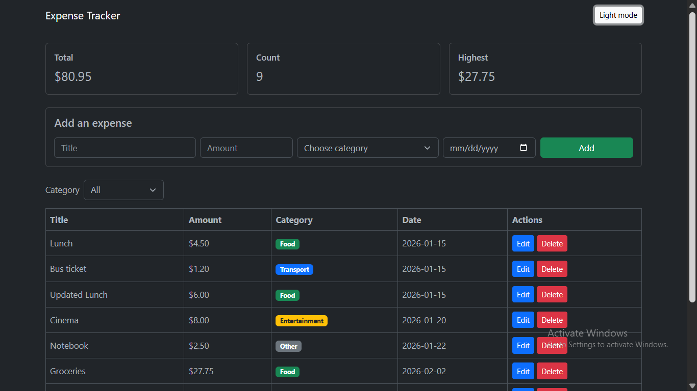
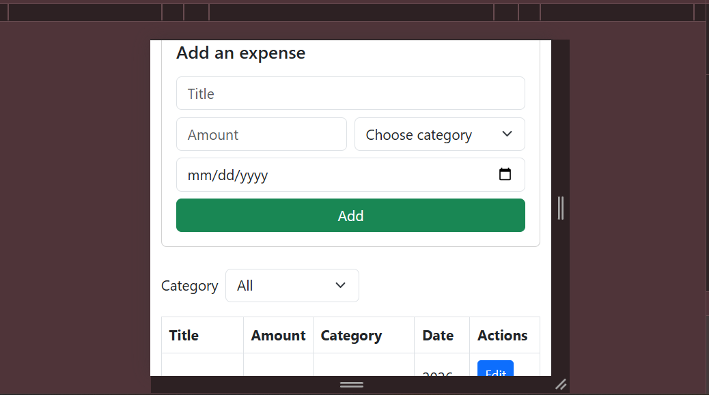

# Expense Tracker

A web app to track my personal expenses. You can add an expense (title, amount, category, date), see everything in a table, filter by category, edit and delete expenses. At the top there are 3 cards: the total, the number of expenses and the highest expense.

Built with HTML, CSS, JavaScript and Bootstrap for the frontend, Node.js + Express for the backend, and PostgreSQL for the database.

Project link (Google Drive): https://drive.google.com/file/d/15VEt-O11bUTmZch0DN2cm2kDBAm8jl5I/view?usp=drive_link

GitHub:https://github.com/rkarme4-star/expense-tracker-app.git

## Folders

- `frontend/` : index.html, css/style.css, js/app.js
- `backend/` : server.js, package.json, schema.sql, .env.example
- `screenshots/` : screenshots of the app and the API tests

## How to run it

You need Node.js, PostgreSQL with pgAdmin, and the Live Server extension in VS Code.

1. Download the project from the Drive link above and unzip it (or clone it from GitHub).
2. Open pgAdmin and create an empty database called `expense_tracker`.
3. Open the Query Tool on that database and run `backend/schema.sql`. It creates the `expenses` table and adds some sample data.
4. In the `backend` folder copy `.env.example` to a new file called `.env` and write your PostgreSQL password in it.
5. Open a terminal in the `backend` folder and run:
   ```
   npm install
   node server.js
   ```
   It should print `Server running on http://localhost:3000`. Leave this terminal open.
6. Open the `frontend` folder in VS Code, right click `index.html` and choose "Open with Live Server".

If the server is not running the page shows an error message instead of the data.

## API

- `GET /api/expenses` : get all expenses
- `GET /api/expenses/:id` : get one expense (404 if not found)
- `POST /api/expenses` : add an expense (201, or 400 if the data is wrong)
- `PUT /api/expenses/:id` : update an expense (400 or 404 on error)
- `DELETE /api/expenses/:id` : delete an expense (404 if not found)

Allowed categories: Food, Transport, Bills, Entertainment, Other.

The server checks that the title is not empty, the amount is a number bigger than 0, the category is one of the allowed ones and the date is there. If not it returns 400 with a message that explains the problem.

All the queries use `$1`, `$2`... so user data is never put inside the SQL text (to avoid SQL injection).

## Screenshots

The app on desktop and on mobile:





API tests are in the `screenshots` folder:

- `get-all-success.jpg`
- `get-one-success.jpg`, `get-one-404.jpg`
- `post-success.jpg`, `post-400.jpg`
- `put-success.jpg`, `put-404.jpg`
- `delete-success.jpg`, `delete-404.jpg`

## The hardest thing

The hardest part was the data coming back from PostgreSQL. The `pg` library returns `NUMERIC` as a string and `DATE` as a JavaScript Date object, so the amount was a text and the date could be one day off. I fixed it in the SQL: `amount::float8` to get a real number and `to_char(date, 'YYYY-MM-DD')` to get the date as a string.
